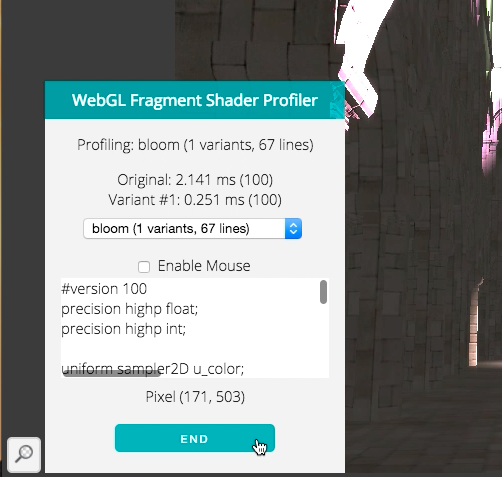

# WebGL Fragment Shader Profiler
[CIS565][cis565] Final Project,
[Terry Sun](http://terrysun.blue) &
[Sally Kong](http://www.kongsally.com/)

## [Video](https://www.youtube.com/watch?v=iM2nibuqaWU)

There are many tools for [profiling JavaScript/WebGL applications][profile], but
none (?) which profile the actual shaders. However, shaders can end up doing
quite a bit of heavy lifting, and we want to minimize the
amount of time they take so Javascript can have all of the fun.

We have built a tool for profiling fragment shaders, potentially a Chrome
extension. This would run on a webpage, access the GLSL programs running on it,
and profile the fragment shader(s) over different pixels.

  [cis565]: cis565-fall-2015.github.io
  [profile]: http://www.realtimerendering.com/blog/webgl-debugging-and-profiling-tools/

### Progress

Class presentations can be found here:

* [Pitch](https://docs.google.com/presentation/d/1ql6i_PHFyAe6U6gH-zOUKhpxpAzX0TQIN0ZWSS-D-2A/edit?usp=sharing)
* [Milestone 1](https://docs.google.com/presentation/d/1SiUU418lQQzw1nnS0Zcmk2OT4B24SbFRJwTcBvBYxPY/edit?usp=sharing)
* [Milestone 2](https://docs.google.com/presentation/d/1HPLnnpjw2ReZOZ5Td3XHB_Z3rfg1j9FKO2kJrvgp9os/edit?usp=sharing)
* [Milestone 3](https://docs.google.com/presentation/d/1upIHXKcaad5nB-Nd1lpLAzsPMyScnBzAQUJCbzc4_m4/edit?usp=sharing)
* [Milestone 4](https://docs.google.com/presentation/d/1c7s_22Zo8IYG6FWvKAEqLfBznxyj_ytWnPDWKFXVl40/edit?usp=sharing)
* [Final] (https://docs.google.com/presentation/d/1c7s_22Zo8IYG6FWvKAEqLfBznxyj_ytWnPDWKFXVl40/edit?ts=566a27e8#slide=id.gdafbcba01_1_59)

### Acknowledgements

We've included [haxe-glsl-editor][haxe-glsl] as library in order to parse and
modify GLSL code.

  [haxe-glsl]: https://github.com/haxiomic/haxe-glsl-parser

Inspiration for hijacking WebGLContexts was found by looking at
[Chrome Shader Editor Extension][shader-editor] and
[WebGL Inspector][webgl-inspector]. (All code in this repository was written by
us.)  
[shader-editor]: https://github.com/spite/ShaderEditorExtension
  [webgl-inspector]: https://benvanik.github.io/WebGL-Inspector/

Finally, thanks to Patrick Cozzi and Kai Ninomiya for teaching and TAing
(respectively) CIS565, without whom this project would not be possible.

### Installation Instructions

This extension relies on the [WebGL disjoint timer query][disjoint-timer]
extension, which is currently only available on pre-release version of Chrome
(Chrome Canary or Chromium). Additionally, you need to enable WebGL draft
extensions at "chrome://flags". You should check that
"EXT\_disjoint\_timer\_query" is listed at
[http://webglreport.com/](http://webglreport.com/).

Then:

1. Download this git repository:
    `git clone https://github.com/terrynsun/WebGL-Fragment-Shader-Profiler.git`.
2. Go to `chrome://extensions` and enable Developer Settings (top right corner).
3. Click "Load unpacked extension" and select `src` from this repo.
4. Find a WebGL app to play with! The extension will show itself as an icon in
   the bottom left.

In order to measure the performance impact of a section of a fragment shader, the shader is re-compiled with a no-op inserted in place of a potentially expensive operation, then profile the new shader. The performance gain from the new shader will reveal the cost of whatever section was replaced.

With pixel-selection support, you could scissor the rendering target in order to
profile only a single pixel or section of the screen.

### Overview

This Chrome extension injects JavaScript into a webpage, which...

1. Overwrites several functions in `WebGLRenderingContext` in order to obtain
   (and store) a list of shaders (and their sources) and programs (and their
   shaders).
2. Overwrites `drawArrays` and inserts timing commands to disjoint timer query
   before and after the draw call itself.
3. Inserts a div into the page containing a pop-up, allowing you to select
   shaders for profiling, and reporting the timing data.

[ TODO - shader variants ]

#### Shaders

We looked into some shader experiments in http://www.kevs3d.co.uk/dev/shaders/ and measured the execution time of some of the shaders

|Distance Field | Distance Field Waves | Mandelbulb | Animated CSG Shape |
|:-------------:|:-------------:|:-------------:|:-------------:|
| |  | |  |
| 13.5 ms | 32.4 ms | 33.8 ms | 7.5 ms |

#### Profiling

We forked the deferred shader of Megan Moore: https://github.com/megmo21/Project6-WebGL-Deferred-Shading then added pragma variants to profile the bloom filter, blinnphong, and ambient shader on. These are the results of the execution time. The left stack represents the execution time of the original code, while the right stack represents the execution time of the code recompiled by the WebGL Shader Profiler where all function calls such as texture2D() were replaced by no-ops. 

![] (img/graph.png)

### Wishlist

A todo section, for the Future when we have time. Suggest more!

* Try injecting code into the definitions of the WebGL context prototype
  functions. Maybe in a draw call you can, e.g., bind a dummy FBO, set a
  scissor around a pixel, start a disjoint timer query, render 1000 times, stop
  timing, then do the real draw call. (-Kai)
* Take a look at [this AMD GPU shader analyzer?][amd-analyzer]
* Discard the first couple of sample data points when profiling (because they don't seem to be very accurate), or do some kind of rolling averaging
* Mouse stuff
* Find some more nice demos
    * See how well this thing works with ShaderEditor to insert #pragmas into random online apps
* Have a few pre-built options, like, "disable all texture2D calls"
* README
* Generate more than one shader variant at a time
* Make sure to load everything in order (sometimes an error is thrown because JS is loaded out of order)

